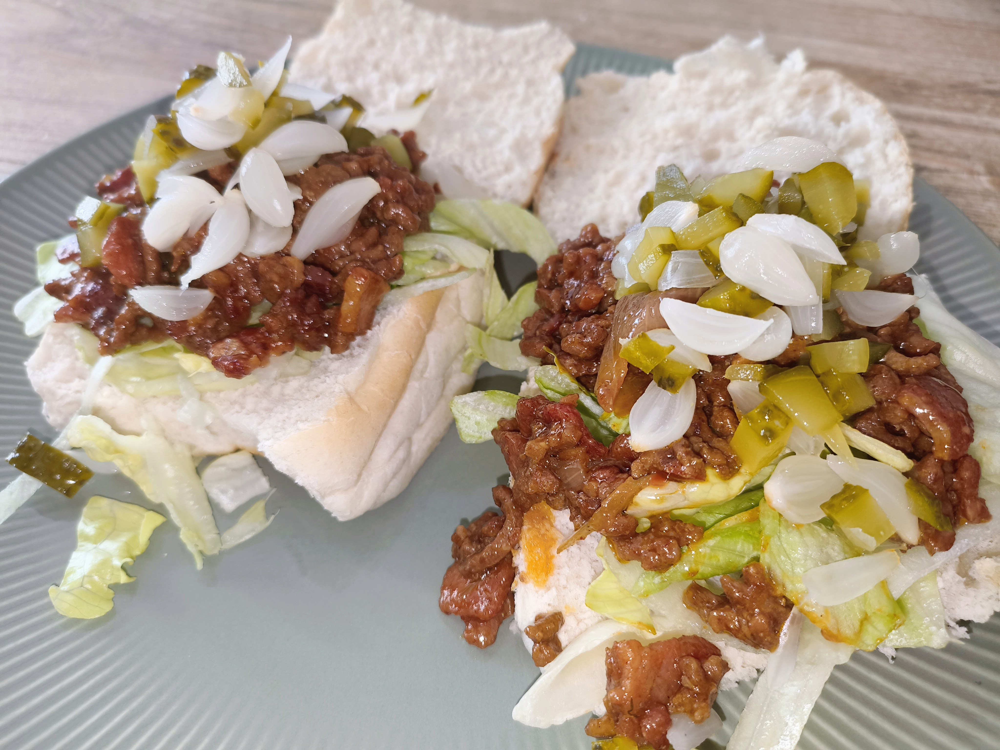

# Sloppy Joe met bacon en kaas

 

## Ingrediënten
- 500 g half-om-half gehakt  
- 1 ui, fijn gesnipperd  
- 6 plakjes bacon, uitgebakken en verkruimeld  
- 240 g BBQ-saus  
- 1 el mosterd  
- 1 el tomatenpuree  
- 1–2 el sojasaus  
- 1 tl appelazijn  
- zout en peper  
- geraspte kaas  
- 4 kadetjes 

## Instructies

### 1.0 Voorbereiden
- Snij de spek in blokjes van 1 x 1 cm.
- Bak de spek uit met een beetje boter

### 1.1 Voorbereiden
- Bak het gehakt rul en bruin in een pan of Crockpot
- Snij een ui in stukjes 
- Voeg de ui toe en bak 2–3 minuten mee  
- Breng op smaak met zout en peper  

### 2. Slowcooker
- Doe het gehakt-ui mengsel in de slowcooker  
- Voeg bacon, BBQ-saus, mosterd, tomatenpuree, sojasaus en appelazijn toe  
- Meng goed door  

### 3. Garen
- 4–5 uur op LOW  

### 4. Afmaken
- Roer goed door  
- Proef en voeg eventueel extra zout of een klein scheutje azijn toe  

### 5. Serveren
- Schep op de kadetjes 
- Eerst een beetje ijsbergsla (optie)
- Zilveruitjes of augurkjes (optie)
- Top met geraspte kaas (optie)